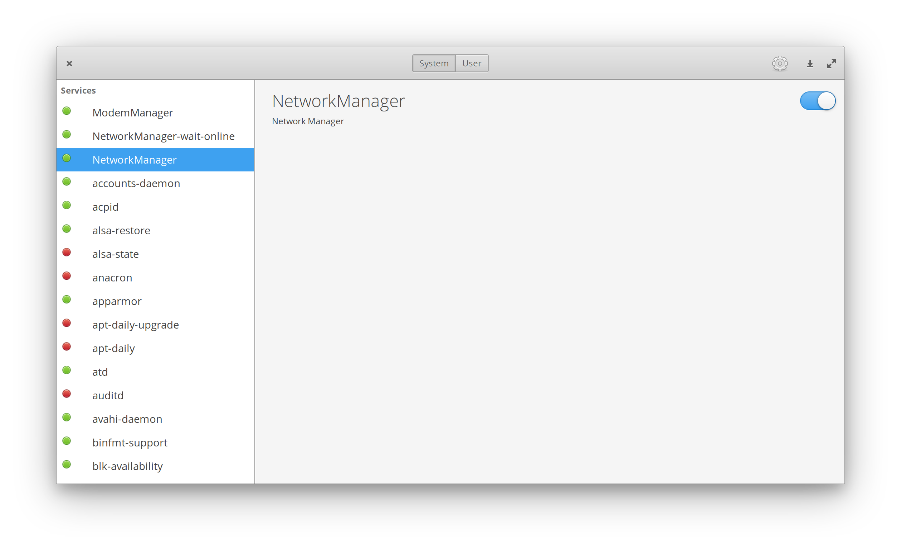

# service-man
A graphical interface for SystemD services on elementaryOS.

## Building
- If not yet installed, install `elementary-sdk` with `sudo apt install elementary-sdk`
- Run `meson build --prefix=/usr` to generate the build files
- `cd build && ninja`
